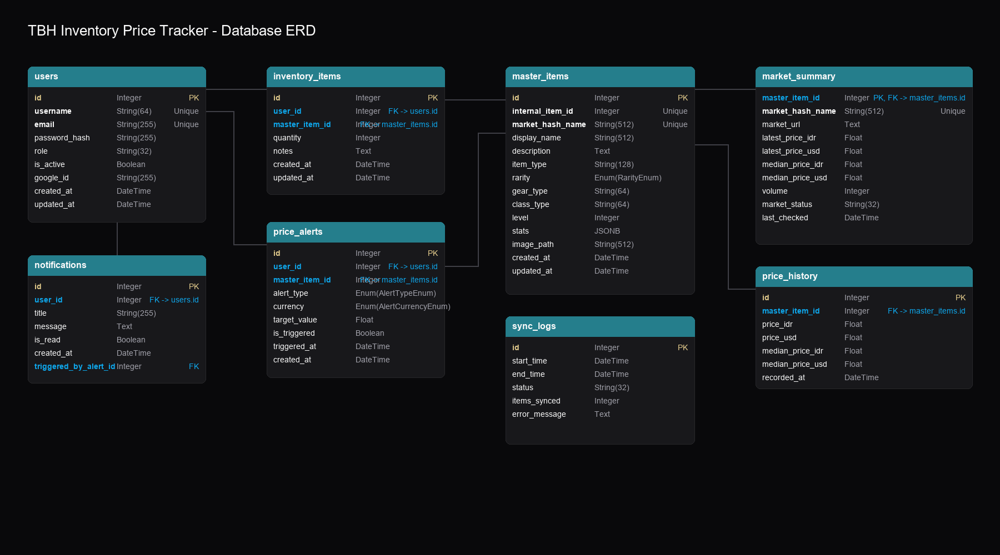

# TBH Inventory Price Tracker

App Link : http://localhost:3000

This project focuses on designing and implementing a **Task Bar Hero (TBH) Inventory Price Tracker** to support **monitoring, valuation, and alerting** for *Task Bar Hero* in-game items traded on the Steam Community Market.

The system tracks dynamic price fluctuations in IDR and USD, calculates cumulative portfolio values, and triggers custom price alerts.

---

## 🎯 Project Objectives
- Centralize in-game item inventory management for players
- Enable analytical tracking of items and cumulative values
- Provide real-time price updates (IDR & USD) and automated price synchronization
- Support price threshold notifications (alerts) to aid trading decisions

---

## 🏗️ Database Architecture & ERD
This project follows a relational database schema designed to support user accounts, inventory portfolios, historical pricing logs, and system settings.

### 📊 Database Schema
The database is structured with the following key tables:

**User & Portfolio Tables**
- `users` — Represents registered user accounts
- `inventory_items` — Represents items added to user portfolios (quantity, custom notes)

**Item & Pricing Tables**
- `master_items` — Canonical registry of TBH items
- `market_summary` — Latest pricing, volume, and last check times from Steam
- `price_history` — Historical price logs for charting

**Alerts & Logging Tables**
- `price_alerts` — Configured price thresholds (buy/sell targets)
- `notifications` — Mailbox warnings and system messages
- `sync_logs` — Logs history of background price synchronizations

---

## 🔄 ETL & Data Flow
The system implements a continuous data flow process:

1. **Extract & Seed**  
   Fetches the global catalogue of TBH items from the Steam Community Market and initializes the `master_items` registry.

2. **Dynamic Sync**  
   - A background scheduler runs every 30 minutes to fetch live prices for all tracked items.
   - Cleanses price formats and stores them in both IDR (Rupiah) and USD.
   - Saves records into `price_history` for line charting.

3. **Alert Evaluation**  
   - Immediately after price updates, the system scans configured `price_alerts`.
   - If a threshold is crossed, a new record is created in `notifications` to alert the user.

---

## 🚀 Documentation

### 💻 User Interface (UI)

#### 📊 Dashboard Page
Shows cumulative inventory values, change rates, latest price updates, recent notifications, and the price alert history chart.

#### 📦 Inventory Page
Manage items, quantities, custom notes, edit details, set alerts, or delete items via a custom Portal-rendered verification modal.

#### 🔍 Browse Items Page
Allows searching and browsing the master list of TBH items, with active sync tools to fetch items from the Steam Market.

#### 📖 How To Use Page
Guide on how to configure, set up, and make the most out of the tracker.

#### ℹ️ About Page
Displays details about the application version (dynamic theme-aware badge), game details, and unofficial disclaimer.

---

## 🛠️ Tools & Technologies

- **Database**: SQLite (SQLAlchemy 2.x ORM)
- **Backend Framework**: FastAPI (Python)
- **Frontend Framework**: Next.js 14 App Router, TypeScript, React Portals
- **Task Scheduling**: APScheduler (Python background jobs)
- **Containerization**: Docker & Docker Compose

Thanks for visiting and checking out my code!
***Copyright © 2026 by Steven | All Rights Reserved**
Built for portfolio and personal use.
