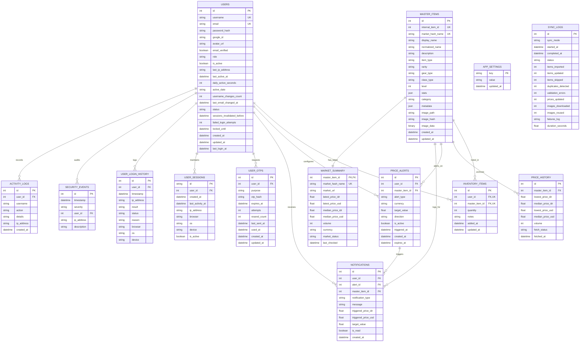

# TBH Inventory Price Tracker

App Link : https://tbh-price.stevchrist.site/

This project focuses on designing and implementing a **Task Bar Hero (TBH) Inventory Price Tracker** to support **monitoring, valuation, and alerting** for *Task Bar Hero* in-game items traded on the Steam Community Market.

The system tracks dynamic price fluctuations in IDR and USD, calculates cumulative portfolio values, and triggers custom price alerts.

---

## 🎯 Project Objectives
- Centralize in-game item inventory management for players
- Enable analytical tracking of items and cumulative values
- Provide real-time price updates (IDR & USD) and automated price synchronization
- Support price threshold notifications (alerts) to aid trading decisions

---

## 🏗️ Database Architecture & ERD
This project follows a relational database schema designed to support user accounts, inventory portfolios, historical pricing logs, security auditing, and system settings.

### 📊 Database Schema
The database is structured with the following key tables:

**User & Portfolio Tables**
- `users` — Represents registered user accounts. Stores hashed credentials, OAuth markers, account verification state, last activity details, and lockout credentials.
- `inventory_items` — Represents items added to user portfolios. Stores quantities and custom notes, linking a user to specific `master_items`.

**Item & Pricing Tables**
- `master_items` — Canonical registry of TBH items with metadata (display name, description, rarity, gear/class constraints, and optimized item icons).
- `market_summary` — Latest pricing data, trading volumes, status, and last checked timestamps from Steam (1-to-1 relationship with `master_items`).
- `price_history` — Historical lowest/median price records (both IDR & USD) for graphing trends.

**Alerts & Logging Tables**
- `price_alerts` — Configured price thresholds (buy/sell targets, currencies) set by users for specific items.
- `notifications` — Warning notifications and alerts generated when configured price thresholds are triggered.
- `sync_logs` — Detailed stats, metrics, durations, and traceback details for background synchronization runs.

**Security, Authentication & Session Tables**
- `user_sessions` — Active user sessions track session tokens, IP addresses, and parsed browser, OS, and device types.
- `user_otps` — One-time passwords (OTP) stored securely as HMAC-SHA256 hashes with cooldown counters and expirations for registration, password resets, account deletion, or email changes.
- `user_login_history` — Comprehensive audit logs of user login attempts (IP, browser, OS, device, success/failure details).
- `security_events` — Severity-rated audit logs tracking potential security alerts, lockouts, or anomalous behaviors.
- `activity_logs` — System and user action trails (creation, updates, deletions) for auditing.
- `app_settings` — Key-value application configuration store seeded on start.

#### 🗺️ Entity Relationship Diagram (ERD)

Below is the dynamic rendering of the database schema and its table relationships. You can view the static diagram at [erd.png](file:///d:/.Portofolio/Coding/TBH-Price/Design/erd.png).

```mermaid
erDiagram
    USERS ||--o{ INVENTORY_ITEMS : owns
    USERS ||--o{ PRICE_ALERTS : configures
    USERS ||--o{ NOTIFICATIONS : receives
    USERS ||--o{ USER_OTPS : requests
    USERS ||--o{ USER_SESSIONS : maintains
    USERS ||--o{ USER_LOGIN_HISTORY : logs
    USERS ||--o{ SECURITY_EVENTS : audits
    USERS ||--o{ ACTIVITY_LOGS : records

    MASTER_ITEMS ||--o{ INVENTORY_ITEMS : listed_in
    MASTER_ITEMS ||--o{ PRICE_HISTORY : archives
    MASTER_ITEMS ||--o{ PRICE_ALERTS : alerts_on
    MASTER_ITEMS ||--o{ NOTIFICATIONS : logs_for
    MASTER_ITEMS ||--|| MARKET_SUMMARY : has_latest

    PRICE_ALERTS ||--o{ NOTIFICATIONS : triggers

    USERS {
        int id PK
        string username UK
        string email UK
        string password_hash
        string google_id
        string avatar_url
        boolean email_verified
        string role
        boolean is_active
        string last_ip_address
        datetime last_active_at
        int daily_active_seconds
        string active_date
        int username_changes_count
        datetime last_email_changed_at
        string status
        datetime sessions_invalidated_before
        int failed_login_attempts
        datetime locked_until
        datetime created_at
        datetime updated_at
        datetime last_login_at
    }

    MASTER_ITEMS {
        int id PK
        int internal_item_id UK
        string market_hash_name UK
        string display_name
        string normalized_name
        string description
        string item_type
        string rarity
        string gear_type
        string class_type
        int level
        json stats
        string category
        json metadata
        string image_path
        string image_hash
        binary image_data
        datetime created_at
        datetime updated_at
    }

    INVENTORY_ITEMS {
        int id PK
        int user_id FK,UK
        int master_item_id FK,UK
        int quantity
        string notes
        datetime added_at
        datetime updated_at
    }

    MARKET_SUMMARY {
        int master_item_id PK,FK
        string market_hash_name UK
        string market_url
        float latest_price_idr
        float latest_price_usd
        float median_price_idr
        float median_price_usd
        int volume
        string currency
        string market_status
        datetime last_checked
    }

    PRICE_HISTORY {
        int id PK
        int master_item_id FK
        float lowest_price_idr
        float median_price_idr
        float lowest_price_usd
        float median_price_usd
        int volume
        string fetch_status
        datetime fetched_at
    }

    PRICE_ALERTS {
        int id PK
        int user_id FK
        int master_item_id FK
        string alert_type
        string currency
        float target_value
        string direction
        boolean is_active
        datetime triggered_at
        datetime created_at
        datetime expires_at
    }

    NOTIFICATIONS {
        int id PK
        int user_id FK
        int alert_id FK
        int master_item_id FK
        string notification_type
        string message
        float triggered_price_idr
        float triggered_price_usd
        float target_value
        boolean is_read
        datetime created_at
    }

    USER_OTPS {
        int id PK
        int user_id FK
        string purpose
        string otp_hash
        datetime expires_at
        int attempts
        int resend_count
        datetime last_sent_at
        datetime used_at
        datetime created_at
        datetime updated_at
    }

    USER_SESSIONS {
        string id PK
        int user_id FK
        datetime created_at
        datetime last_activity_at
        string ip_address
        string browser
        string os
        string device
        boolean is_active
    }

    USER_LOGIN_HISTORY {
        int id PK
        int user_id FK
        datetime timestamp
        string ip_address
        string result
        string status
        string reason
        string browser
        string os
        string device
    }

    SECURITY_EVENTS {
        int id PK
        datetime timestamp
        string severity
        int user_id FK
        string ip_address
        string description
    }

    ACTIVITY_LOGS {
        int id PK
        int user_id FK
        string username
        string action
        string details
        string ip_address
        datetime created_at
    }

    APP_SETTINGS {
        string key PK
        string value
        datetime updated_at
    }

    SYNC_LOGS {
        int id PK
        string sync_mode
        datetime started_at
        datetime completed_at
        string status
        int items_imported
        int items_updated
        int items_skipped
        int duplicates_detected
        int validation_errors
        int prices_updated
        int images_downloaded
        int images_reused
        string failures_log
        float duration_seconds
    }
```

---

## 🔄 ETL & Data Flow
The system implements a continuous data flow process:

1. **Extract & Seed**  
   Fetches the global catalogue of TBH items from the Steam Community Market and initializes the `master_items` registry.

2. **Dynamic Sync**  
   - A background scheduler runs every 30 minutes to fetch live prices for all tracked items.
   - Cleanses price formats and stores them in both IDR (Rupiah) and USD.
   - Saves records into `price_history` for line charting.

3. **Alert Evaluation**  
   - Immediately after price updates, the system scans configured `price_alerts`.
   - If a threshold is crossed, a new record is created in `notifications` to alert the user.

---

## 🚀 Documentation

### 💻 User Interface (UI)

#### 📊 Dashboard Page
Shows cumulative inventory values, change rates, latest price updates, recent notifications, and the price alert history chart.

#### 📦 Inventory Page
Manage items, quantities, custom notes, edit details, set alerts, or delete items via a custom Portal-rendered verification modal.

#### 🔍 Browse Items Page
Allows searching and browsing the master list of TBH items, with active sync tools to fetch items from the Steam Market.

#### 📖 How To Use Page
Guide on how to configure, set up, and make the most out of the tracker.

#### ℹ️ About Page
Displays details about the application version (dynamic theme-aware badge), game details, and unofficial disclaimer.

---

## 🛠️ Tools & Technologies

The application is built using a modern, production-grade technical stack designed for reliability, scalability, and clean architecture.

### 🎨 Frontend Stack
- **Framework**: **Next.js 16 (App Router)** & **React 19** with **TypeScript** for robust typing.
- **Styling**: **Tailwind CSS v4** (utilizing `@tailwindcss/postcss`) and **Class Variance Authority (CVA)** for responsive, utility-first design.
- **UI Components**: Built using **Radix UI Primitives** (Avatar, Dialog, Dropdown, Select, Switch, Tabs, Tooltip) for high accessibility and interactive elements.
- **Data Tables**: **TanStack Table (`@tanstack/react-table` v8)** to handle client-side sorting, pagination, and search queries efficiently.
- **Data Visualization**: **Recharts** for plotting pricing charts and inventory trends.
- **State Management & Fetching**: **Axios** for API communication combined with custom hooks for tracking active sessions and configurations.
- **Toasts**: **Sonner** for smooth, elegant user alerts.

### ⚙️ Backend Stack
- **Framework**: **FastAPI (Python 3.x)** leveraging asynchronous endpoints (`async/await`) for fast response times.
- **Server**: **Uvicorn** ASGI server for production deployment.
- **Database & ORM**: **SQLite** (using **SQLAlchemy 2.0** and **aiosqlite** for asynchronous SQL execution). Configured with **asyncpg** compatibility for PostgreSQL transition.
- **Migrations**: **Alembic** to handle database schema upgrades and rollback tracking.
- **Background Scheduling**: **APScheduler** to execute recurring Steam Community Market synchronization tasks.
- **HTTP Client**: **HTTPX** for async requests to the Steam API.
- **Data Validation**: **Pydantic v2** & **Pydantic Settings** for schema validation and settings parsing.
- **Image Processing**: **Pillow (PIL)** to process, download, and store local WebP item icons from Steam.

### 🌐 DevOps & Infrastructure
- **Containerization**: **Docker** and **Docker Compose** to run frontend (Next.js), backend (FastAPI), static directories, and database services in isolated environments.
- **Secrets Management**: Configuration via `.env` files mapping SMTP configs, security keys, and token lifetimes.

Thanks for visiting and checking out my code!

---

## 🔒 Authentication & OTP Infrastructure

The project includes a robust, production-grade security and authentication system incorporating:
1. **HttpOnly Cookie JWT Session**: Session tokens (`access_token`) are stored strictly in client browsers via secure HttpOnly cookies to mitigate XSS risks. Local storage is never used for authentication.
2. **Register Verification**: User accounts are created in an unverified state; activation requires entering a 6-digit OTP code sent via email. The account cannot be logged into until verified.
3. **Forgot Password**: Secured by email OTP verification. Password reset requests require validation of the code before allowing updates. Endpoints protect against email enumeration.
4. **Delete Account**: Highly secure flow requiring password validation followed by a second-factor OTP confirmation before permanent cascade deleting the user and all associated sessions, alerts, and inventory items.
5. **Email Change Verification**: Allows users to change their email address securely, requiring a verification OTP code sent to the new email address before updating.
6. **Active Session Tracking & Device Auditing**: Sessions (`user_sessions` table) are tracked dynamically. The backend parses User-Agent strings to record browser, OS, and device types (Desktop/Mobile/Tablet) along with the IP address for all active logins.
7. **Failed Login Lockouts**: To prevent brute-force attacks, accounts are locked temporarily (`locked_until` field in `users`) after multiple consecutive failed login attempts (`failed_login_attempts`), restricting authentication until the lockout window passes.
8. **Auth Rate Limiting**: Key authentication endpoints are governed by an in-memory rate limiter to prevent spamming and Denial of Service (DoS) attempts.
9. **HMAC-SHA256 OTP Storage**: One-time passwords are never stored in plaintext in the database. The system hashes OTP codes using HMAC-SHA256, protecting user codes in case of database exposure.
10. **Security Event Audit Logging**: Key events (e.g. login failures, lockouts, register, account deletion, email changes) write to a dedicated severity-rated security log (`security_events` and `activity_logs`) for administrative tracing.

### ⚙️ OTP Configuration (.env)

The following parameters in `.env` govern the OTP system:
- `SMTP_HOST`: Host of your SMTP provider (e.g. `smtp.gmail.com`). Leave empty to log OTP codes to stdout.
- `SMTP_PORT`: Port (typically `587` or `465`).
- `SMTP_USERNAME` / `SMTP_PASSWORD`: SMTP credentials.
- `SMTP_FROM`: Sender address.
- `OTP_EXPIRE_MINUTES`: Expiry window for OTP codes (default: `5`).
- `OTP_RESEND_SECONDS`: Cooldown interval in seconds before a code can be resent (default: `60`).
- `OTP_MAX_ATTEMPTS`: Max incorrect OTP entry attempts before code is invalidated (default: `5`).
- `OTP_MAX_RESEND`: Max resend requests permitted per session (default: `3`).

---
***Copyright © 2026 by Steven | All Rights Reserved**

Built for portfolio and personal use.
