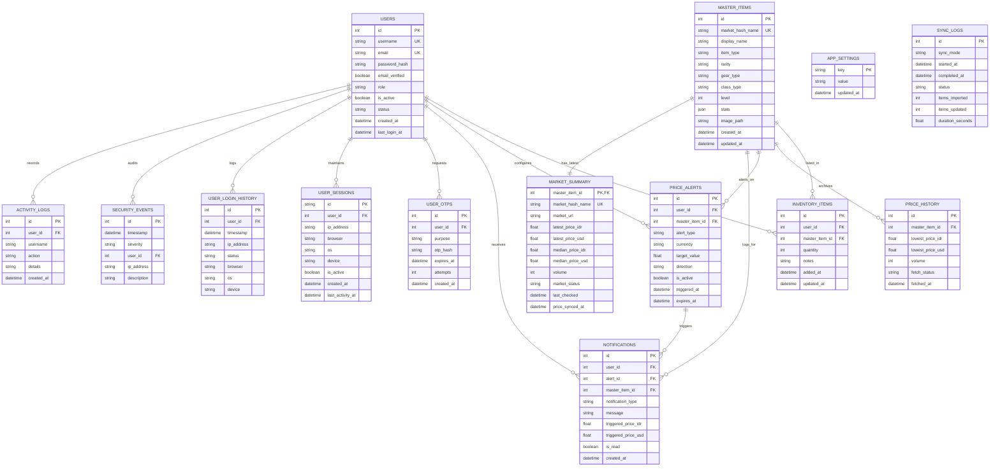

# TBH Inventory Price Tracker

> A personal inventory price tracker for **Task Bar Hero (TBH)** items traded on the Steam Community Market.

[](https://tbh-price.stevchrist.site/)
[](#)
[](#)

---

## 📋 Overview

TBH Inventory Price Tracker helps Task Bar Hero players **monitor, value, and track** their in-game item portfolios against the Steam Community Market. It provides real-time price updates in both **IDR (Rupiah)** and **USD**, calculates portfolio value, and notifies users when prices hit their configured thresholds.

---

## ✨ Features

- **Inventory Management** — Add, edit, and manage your TBH item inventory with quantities and notes
- **Live Price Tracking** — Prices auto-sync from Steam Market every 30 minutes (IDR & USD)
- **Tradable Indicator** — Items are marked Tradable / Not Tradable so you always know why a price isn't shown
- **Portfolio Analytics** — Dashboard shows total portfolio value, highest-value item, and price trend charts
- **Items Analytics** — Market analysis charts and data-driven insights with EN/ID language toggle
- **Price Alerts** — Set custom price thresholds; get notified when an item's price crosses your target
- **Browse Catalog** — Search and filter the full TBH item catalog (~5,900+ items) with rarity, type, and tradability filters
- **Dark / Light Mode** — Full theme support
- **Secure Authentication** — Email-verified registration, OTP-protected password reset, session tracking

---

## 🏗️ Architecture

```
┌─────────────────┐     ┌─────────────────────────────┐     ┌────────────────┐
│  Next.js 16     │────▶│  FastAPI (Python)             │────▶│  PostgreSQL    │
│  Frontend       │◀────│  REST API + APScheduler       │◀────│  Database      │
│  (React 19)     │     │  Background Price Sync        │     │  (Docker)      │
└─────────────────┘     └─────────────────────────────┘     └────────────────┘
                                    │
                                    ▼
                         Steam Community Market
                         (Search/Render API — read-only)
```

**Price Sync Strategy:**
- Every 30 minutes, the backend fetches prices for all ~935 tradable items via Steam's paginated Search/Render API (~10 requests total)
- All user-facing pages read prices from the local database cache — the Steam API is never called in real-time per user action
- This keeps the system within Steam's rate limits while ensuring fresh data every 30 minutes

---

## 🗺️ Database Schema (ERD)


```mermaid
erDiagram
    USERS ||--o{ INVENTORY_ITEMS : owns
    USERS ||--o{ PRICE_ALERTS : configures
    USERS ||--o{ NOTIFICATIONS : receives
    USERS ||--o{ USER_OTPS : requests
    USERS ||--o{ USER_SESSIONS : maintains
    USERS ||--o{ USER_LOGIN_HISTORY : logs
    USERS ||--o{ SECURITY_EVENTS : audits
    USERS ||--o{ ACTIVITY_LOGS : records

    MASTER_ITEMS ||--o{ INVENTORY_ITEMS : listed_in
    MASTER_ITEMS ||--o{ PRICE_HISTORY : archives
    MASTER_ITEMS ||--o{ PRICE_ALERTS : alerts_on
    MASTER_ITEMS ||--o{ NOTIFICATIONS : logs_for
    MASTER_ITEMS ||--|| MARKET_SUMMARY : has_latest

    PRICE_ALERTS ||--o{ NOTIFICATIONS : triggers

    USERS {
        int id PK
        string username UK
        string email UK
        string password_hash
        boolean email_verified
        string role
        boolean is_active
        string status
        datetime created_at
        datetime last_login_at
    }

    MASTER_ITEMS {
        int id PK
        string market_hash_name UK
        string display_name
        string item_type
        string rarity
        string gear_type
        string class_type
        int level
        json stats
        string image_path
        datetime created_at
        datetime updated_at
    }

    INVENTORY_ITEMS {
        int id PK
        int user_id FK
        int master_item_id FK
        int quantity
        string notes
        datetime added_at
        datetime updated_at
    }

    MARKET_SUMMARY {
        int master_item_id PK,FK
        string market_hash_name UK
        string market_url
        float latest_price_idr
        float latest_price_usd
        float median_price_idr
        float median_price_usd
        int volume
        string market_status
        datetime last_checked
        datetime price_synced_at
    }

    PRICE_HISTORY {
        int id PK
        int master_item_id FK
        float lowest_price_idr
        float lowest_price_usd
        int volume
        string fetch_status
        datetime fetched_at
    }

    PRICE_ALERTS {
        int id PK
        int user_id FK
        int master_item_id FK
        string alert_type
        string currency
        float target_value
        string direction
        boolean is_active
        datetime triggered_at
        datetime expires_at
    }

    NOTIFICATIONS {
        int id PK
        int user_id FK
        int alert_id FK
        int master_item_id FK
        string notification_type
        string message
        float triggered_price_idr
        float triggered_price_usd
        boolean is_read
        datetime created_at
    }

    USER_SESSIONS {
        string id PK
        int user_id FK
        string ip_address
        string browser
        string os
        string device
        boolean is_active
        datetime created_at
        datetime last_activity_at
    }

    USER_LOGIN_HISTORY {
        int id PK
        int user_id FK
        datetime timestamp
        string ip_address
        string status
        string browser
        string os
        string device
    }

    USER_OTPS {
        int id PK
        int user_id FK
        string purpose
        string otp_hash
        datetime expires_at
        int attempts
        datetime created_at
    }

    SECURITY_EVENTS {
        int id PK
        datetime timestamp
        string severity
        int user_id FK
        string ip_address
        string description
    }

    ACTIVITY_LOGS {
        int id PK
        int user_id FK
        string username
        string action
        string details
        datetime created_at
    }

    APP_SETTINGS {
        string key PK
        string value
        datetime updated_at
    }

    SYNC_LOGS {
        int id PK
        string sync_mode
        datetime started_at
        datetime completed_at
        string status
        int items_imported
        int items_updated
        float duration_seconds
    }
```

---

## 🛠️ Tech Stack

### Frontend
| Technology | Purpose |
|---|---|
| **Next.js 16** (App Router) + React 19 + TypeScript | Core framework |
| **Tailwind CSS v4** | Styling |
| **Radix UI Primitives** | Accessible UI components |
| **TanStack Table v8** | Data tables with sorting & pagination |
| **Recharts** | Price charts & analytics visualization |
| **Axios** | API communication |
| **Sonner** | Toast notifications |

### Backend
| Technology | Purpose |
|---|---|
| **FastAPI** (Python 3.x) | REST API framework |
| **Uvicorn** | ASGI server |
| **SQLAlchemy 2.0** + **asyncpg** | Async ORM + PostgreSQL driver |
| **APScheduler** | Background price sync scheduler |
| **HTTPX** | Async HTTP client for Steam API |
| **Pydantic v2** | Data validation & settings |
| **Pillow** | Item icon processing |

### Infrastructure
| Technology | Purpose |
|---|---|
| **Docker** + **Docker Compose** | Containerization |
| **PostgreSQL 15** | Production database |
| **.env file** | Secrets & environment configuration |

---

## 🖼️ Screenshots

### Dashboard


### My Inventory


### Browse Items


### How To Use


### About


---

## 🔒 Security Overview

- **JWT via HttpOnly Cookies** — tokens never stored in localStorage
- **Email OTP verification** — required for registration, password reset, account deletion
- **Bcrypt password hashing** — passwords never stored in plaintext
- **HMAC-SHA256 OTP hashing** — OTP codes never stored in plaintext
- **Brute-force protection** — accounts lock after repeated failed login attempts
- **Rate limiting** — key authentication endpoints are rate-limited
- **Session auditing** — active sessions tracked with device, browser, OS, and IP
- **Security event logging** — lockouts, login failures, and sensitive changes are logged

---

## 🚀 Quick Start (Self-Hosted)

> **Prerequisites:** Docker and Docker Compose must be installed.

```bash
# 1. Clone the repository
git clone https://github.com/StevChrist/tbh-pricing.git
cd tbh-pricing

# 2. Create your environment file
cp .env.example .env
# Edit .env and fill in your SECRET_KEY and (optional) SMTP settings

# 3. Start all services
docker compose up -d

# 4. Open the app
# http://localhost:3000
```

> **Note:** On first boot, the backend automatically seeds the full item catalog (~5,900 items) from the Steam Market. This may take several minutes.

---

## 📝 Changelog

### V2.1.0 *(Current)*
- ✅ Items Analytics section on Dashboard (market charts, trend analysis, EN/ID insights)
- ✅ Tradable indicator added to Inventory, Browse, and Add Item flow
- ✅ About page with clickable version badges and changelog history
- ✅ How To Use page with collapsible accordion sections
- ✅ Price cache architecture — all prices read from DB, never per-user Steam API calls
- ✅ Automatic price sync every 30 minutes via Steam Search/Render API

### V1.1.0 *(Previous)*
- ✅ Core inventory management (add, edit, delete items)
- ✅ Steam price tracking with IDR & USD display
- ✅ Price alert system with threshold notifications
- ✅ Browse full TBH item catalog
- ✅ Dark/Light mode toggle
- ✅ Secure authentication with OTP email verification

---

*© 2026 Steven — Built for portfolio and personal use. Not affiliated with Task Bar Hero or Steam.*
